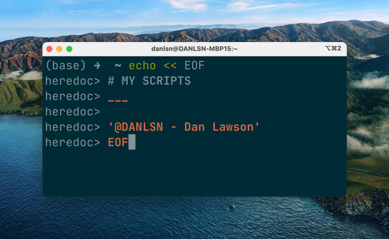

# My Scripts
___
## To-do: Tools & Programs
- Duplicacy
- Exiftool
- borgbackup
- chezmoi
- ffmpeg
- iftop
- jq/gron
- m-cli
- pass
- q
- rclone
- rename (perl)
- rmlint
- rsync
- stegcloak
- tmux
- unar
- up - The Ultimate Plumber
- yank
- youtube-dl

___
# To-do: Common Tasks
- Backup .dotfiles on My Mac
- Catalog File Locations with Hashes
- Create Backblaze Backup Summary
- Create Directory Trees/Manifests
- Create Local Mirrors of Websites
- Delete Empty Folders
- Extract Archives & Safely Remove
- List of Unique Files with rmlint
- Rename Folders with Rules

___
# To-do: Publish Existing Scripts
- badvideos.sh
- borgmount
- exifjson
- local-move
- manifest/3
- rclone-move
- rcopier/rmover
- run-exiftool

___
## To-do: Investigate Tools & Improvements
- Task Queuing (pueue)
- Create File Templates & Style Guide
- Unit Testing & Flag Processing
- Options & Argument Processing
- Command Line Text Processing (grep/sed/awk)
- Learn to Build Linux Pipelines (akavel/up)

___
## Bookmarks & Reference
1. Option/Argument Parser - [ko1nksm/getoptions](https://github.com/ko1nksm/getoptions)
2. Shell Script Unit Test Framework - [kward/shunit2](https://github.com/kward/shunit2)
3. [Command Line Text Processing with GNU Coreutils](https://learnbyexample.github.io/cli_text_processing_coreutils/)
4. Awesome CLI Apps - [agarrharr/awesome-cli-apps](https://github.com/agarrharr/awesome-cli-apps)
